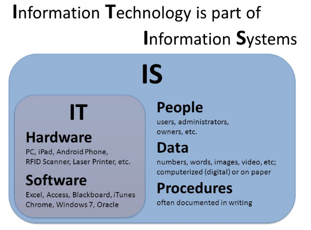

Fiche exercice

IT : TIC, technologie de l'info et de la com

IS : SI, système d'info

### Exercice 1
1) Quels éléments dans le texte pouvez-vous associer aux TIC ?
* SNCF Connect
* Voyages-sncf.com
* deployment du wifi
* site ouisncf
* developpement de capteur dans les trains
* lunette connectée

2) Dans cet exemple, en quoi le SI a une dimension stratégique ?

* layering : on va tellement rendre le service indispensable que tout va passé par nous

### Exercice 2

1) le pigeon est arriver à réaliser une tâche grâce à la récompense qui lui est donnée à chaque fois qu'il l'a réalise

### Exercice 3
1) Comercialiser des ordinateur muni d'un pseudo excel ou d'une interface graphique facile d'utilisation
ordinateur qui coute moins cher, l'utilisation d'une souris

### Exercice 4
la Marketplace -> un site en ligne regroupant plusieur vendeur/ particulier: innovation de procesus d'affaire
la capsule de café -> mettre le cafe en capsule : innovation de produit
L'application Airbnb -> : innovation de procesus d'affaire

notion a savoir:

SI
TIC
DICS
innovation
Systeme